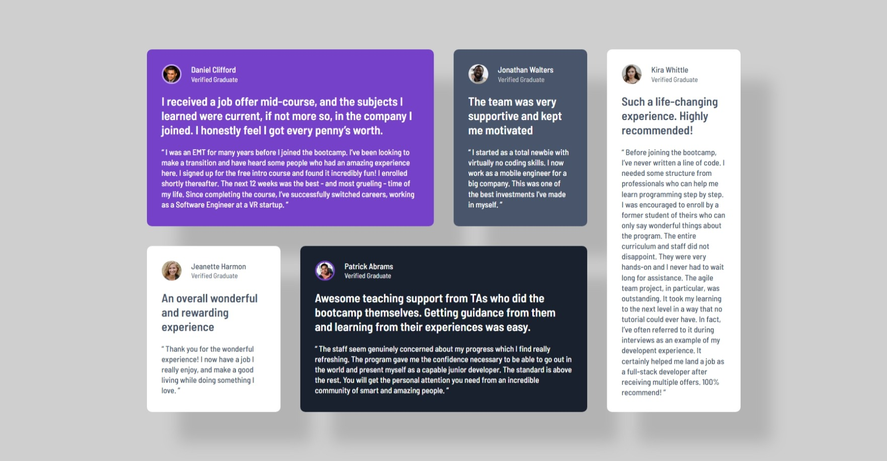

# Frontend Mentor - Testimonials grid section solution

This is a solution to the [Testimonials grid section challenge on Frontend Mentor](https://www.frontendmentor.io/challenges/testimonials-grid-section-Nnw6J7Un7). Frontend Mentor challenges help you improve your coding skills by building realistic projects. 

## Table of contents

- [Overview](#overview)
  - [The challenge](#the-challenge)
  - [Screenshot](#screenshot)
  - [Links](#links)
- [My process](#my-process)
  - [Built with](#built-with)
  - [What I learned](#what-i-learned)
  - [Useful resources](#useful-resources)


## Overview

### The challenge

Users should be able to:

- View the optimal layout for the site depending on their device's screen size

### Screenshot




### Links

- Solution URL: (https://github.com/My-Frontend-Mentors-Challenges/testimonials-grid-section-main)
- Live Site URL: (https://my-frontend-mentors-challenges.github.io/testimonials-grid-section-main/)

## My process

### Built with

- Semantic HTML5 markup
- CSS custom properties
- Flexbox
- CSS Grid
- Grid template areas
- Mobile-first workflow
- Box shadow


### What I learned

```css
header{
  grid-template-columns: min-content max-content;
}
```
I used grid to deal with img and the 2 paragraphs in the header of each article, it makes the space be small as the inline img and max-content to text to only fit it in one line without breaking it to new lines.
I could use flex and I used it successfully at first, but I prefered to try the grid and it worked.
I've learnt how to use the grid area for the first time, it's simpler and easier I think than making spans between columns and rows.
I've learnt more about using box shadow with this precise result, and altered its color by myself especially the lightness.
Edit: I used different background color for body so it wasn't working, now I get it.
I just noticed that I didn't add the img of quote in the danial article, so I also learnt to implement the position with absolute and relative and using z-index.


### Useful resources

- [Example resource 1](https://developer.mozilla.org/en-US/docs/Web/CSS/Reference) 

